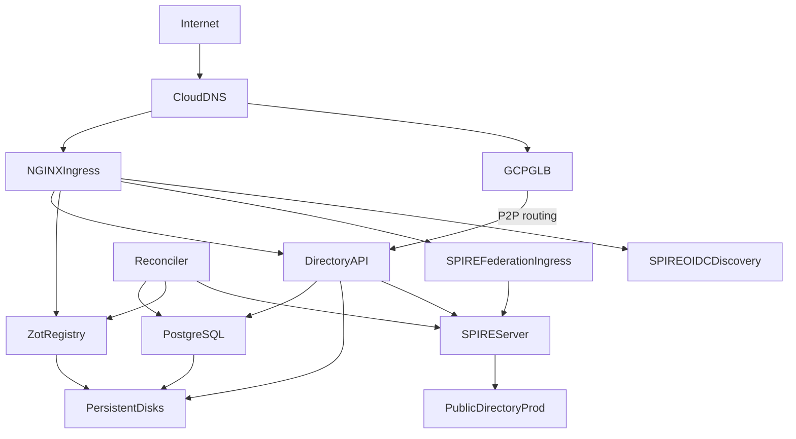

# Federation on Google GKE

This guide is the opinionated GCP happy path for running your own AGNTCY Directory instance and
federating it with the public Directory network.

It makes the following choices for you:
* Google Cloud Platform
* Google Kubernetes Engine (GKE)
* Terraform-first deployment
* `https_web` SPIRE federation
* NGINX ingress
* Cloud DNS with ExternalDNS
* cert-manager with Let's Encrypt
* Persistent Disk-backed persistence
* Zot as the OCI registry
* SPIRE as the workload identity system

If you want the reference material behind this guide, see the following guides:
* [Production Deployment](../dir-prod-deployment/)
* [Running a Federated Directory Instance](../dir-federation-setup/)
* [Federation Bundle Profiles](../dir-federation-profiles/)
* [Federation Best Practices and Troubleshooting](../dir-federation-troubleshooting/)

This document is intentionally narrow. It does not try to cover GitOps, Azure, AWS, on-premises
deployment, or the `https_spiffe` profile. The goal is to give first-time operators one concrete
path that they can follow end to end.

## What You Will Build



## Decisions Before You Start

Choose these before you install anything:
* Your SPIRE trust domain.
  
  This is permanent for the deployment.
* Your public DNS names.
* Your federation profile.
  
  This guide always uses `https_web`.

To keep the mental model simple, this guide uses the same base domain for both DNS and the trust
domain:
* Trust domain: `partner.example.com`
* Directory API: `api.partner.example.com`
* Zot: `zot.partner.example.com`
* P2P routing: `routing.partner.example.com`
* SPIRE federation endpoint: `spire.partner.example.com`
* SPIRE OIDC discovery: `oidc-discovery.spire.partner.example.com`

**Important Note for GCP:**
If your base domain structure differs from your trust domain (e.g., trust domain is `partner.example.com` but you want `api.dir.example.com`), you must explicitly configure `global.spire.jwtIssuer` in the SPIRE Helm values. The SPIRE chart defaults to deriving OIDC discovery endpoints from the trust domain, which may not match your desired DNS structure.

## Version Pins Used in This Guide

These pins match the current GCP deployment references at the time this guide was written:

──────────────────────────┬──────────────────────────────────────────┬────────
Component                 │Source                                    │Version 
──────────────────────────┼──────────────────────────────────────────┼────────
Directory Helm chart      │`oci://ghcr.io/agntcy/dir/helm-charts/dir`│`v1.5.0`
──────────────────────────┼──────────────────────────────────────────┼────────
Directory apiserver image │`ghcr.io/agntcy/dir-apiserver`            │`v1.5.0`
──────────────────────────┼──────────────────────────────────────────┼────────
Directory reconciler image│`ghcr.io/agntcy/dir-reconciler`           │`v1.5.0`
──────────────────────────┼──────────────────────────────────────────┼────────
SPIRE Helm chart          │`spiffe/spire`                            │`0.29.0`
──────────────────────────┴──────────────────────────────────────────┴────────

## Before You Start

This guide assumes you already have:
* A GKE cluster running and reachable with `kubectl`
* An ingress-nginx controller installed in the cluster
* `--enable-ssl-passthrough=true` enabled on that ingress controller
* cert-manager installed with a production ClusterIssuer such as `letsencrypt-prod`
* ExternalDNS configured to manage records in your Cloud DNS managed zone
* A Persistent Disk-backed StorageClass named `standard-rwo` or similar
* `kubectl`, `helm`, `terraform`, `gcloud`, and `openssl` installed locally
* Appropriate GCP IAM permissions for managing GKE, Cloud DNS, and Compute resources

This guide uses Terraform for infrastructure provisioning rather than manual Helm commands, which provides better reproducibility and state management.

## Setting Up Federation Using GKE GKE

This guide uses Terraform modules for infrastructure provisioning. The implementation is split into reusable modules:

1. **`gke-cluster`** - Provisions GKE cluster
2. **`spire-node`** - Deploys SPIRE with federation and OIDC discovery
3. **`dir-node`** - Deploys AGNTCY Directory with routing service

### 1. Configure GKE Cluster

Create a GKE cluster with the required networking and IAM configuration:

```hcl
module "gke_cluster" {
  source       = "./modules/gke-cluster"
  project_id   = "your-project-id"
  region       = "us-central1"
  cluster_name = "partner"
  machine_type = "e2-medium"
}
```

### 2. Configure SPIRE with Federation and OIDC Discovery

Deploy SPIRE with HTTPS web profile federation and OIDC discovery provider:

```hcl
module "spire" {
  source                 = "./modules/spire-node"
  project_id             = var.project_id
  region                 = var.region
  cluster_name           = var.cluster_name
  trust_domain           = "partner.example.com"
  federation_tls_mode    = "web"
  acme_email             = "your-email@example.com"
  dns_mode               = "managed"
  base_domain            = "partner.example.com"
  dns_project_id         = var.dns_project_id
  dns_zone_name          = "partner-zone"
  external_dns_gsa_email = var.external_dns_gsa_email
  federates_with         = ["spire.ads.outshift.io"]

  providers = {
    kubernetes = kubernetes.gke
    helm       = helm.gke
    kubectl    = kubectl.gke
  }
}
```

**Important OIDC Discovery Configuration:**
The SPIRE Helm chart derives OIDC discovery endpoints from the trust domain by default. If your DNS structure differs from your trust domain, you must explicitly configure `global.spire.jwtIssuer` in the Helm values. This is handled automatically in the `spire-node` module's `web.yaml.tftpl` values file:

```yaml
global:
  spire:
    trustDomain: ${trust_domain}
    clusterName: ${cluster_name}
    jwtIssuer: "oidc-discovery.${fqdn}"  # Critical for custom domain structures
```

### 3. Configure AGNTCY Directory with P2P Routing

Deploy the Directory with P2P routing service for federation peer discovery:

```hcl
module "directory" {
  source                      = "./modules/dir-node"
  project_id                  = var.project_id
  region                      = var.region
  cluster_name                = var.cluster_name
  dir_chart_version           = "v1.5.0"
  zot_pvc_size                = "100Gi"
  federation_peers            = ["spire.ads.outshift.io"]
  authz_policies_csv          = var.authz_policies_csv
  reconciler_enabled          = true
  reconciler_image_tag        = "v1.5.0"

  trust_domain = module.spire.trust_domain
  base_fqdn    = module.spire.federation_fqdn

  acme_email = var.acme_email

  providers = {
    kubernetes = kubernetes.gke
    helm       = helm.gke
    kubectl    = kubectl.gke
  }

  depends_on = [module.spire]
}
```

### 4. Apply the Configuration

Run Terraform to provision the infrastructure:

```bash
cd terraform/environments/your-environment
terraform init
terraform apply
```

### 5. Verify the SPIRE Public Endpoints

After deployment, verify that the ingress objects and public certificates exist:

```bash
kubectl get ingress -n spire-server
kubectl get certificate -n spire-server
```

Verify the federation endpoint:

```bash
curl -I "https://spire.partner.example.com"
```

Verify the OIDC discovery document:

```bash
curl "https://oidc-discovery.spire.partner.example.com/.well-known/openid-configuration" | jq .
```

Expected response should include:
```json
{
  "issuer": "https://oidc-discovery.spire.partner.example.com",
  "jwks_uri": "https://oidc-discovery.spire.partner.example.com/keys",
  "response_types_supported": ["id_token"],
  "subject_types_supported": ["public"],
  "id_token_signing_alg_values_supported": ["RS256", "ES256", "ES384"]
}
```

Verify the JWKS endpoint:

```bash
curl "https://oidc-discovery.spire.partner.example.com/keys" | jq .
```

Confirm that Cloud DNS and ExternalDNS have published the hostnames:

```bash
dig +short "spire.partner.example.com"
dig +short "oidc-discovery.spire.partner.example.com"
```

### 6. Verify the Directory Endpoints and Certificates

Check that the public API hostname presents the SPIFFE-issued certificate:

```bash
echo | openssl s_client -connect "api.partner.example.com:443" \
  -servername "api.partner.example.com" 2>/dev/null | \
  openssl x509 -noout -subject
```

If SSL passthrough is working, the certificate subject should come from SPIRE and not from the
ingress controller.

Confirm that the API server successfully obtained an X.509-SVID:

```bash
kubectl logs -n dir -l app.kubernetes.io/name=apiserver | \
  grep "Successfully obtained valid X509-SVID"
```

Verify that Zot is reachable over HTTPS:

```bash
curl -u "admin:${DIR_OCI_ADMIN_PASSWORD}" "https://zot.partner.example.com/v2/_catalog"
```

Verify the DNS records:

```bash
dig +short "api.partner.example.com"
dig +short "zot.partner.example.com"
```

Verify the persistent volumes:

```bash
kubectl get pvc -n dir -o wide
```

The PVCs should be `Bound` and backed by Persistent Disks.

### 7. Verify P2P Routing Service

The P2P routing service enables peer discovery and publication. Verify it's accessible:

```bash
kubectl get svc -n dir
```

Expected output should show a LoadBalancer service for routing:

```bash
NAME                    TYPE           EXTERNAL-IP     PORT(S)
routing-dir-apiserver   LoadBalancer   34.23.180.114   5555:32145/TCP
```

Test connectivity to the routing endpoint:

```bash
# Check if the routing LoadBalancer is accessible
telnet routing.partner.example.com 5555
```

### 8. Confirm Federation with the Public Directory

The first proof point is that your SPIRE server can fetch the public Directory trust bundle:

```bash
kubectl exec -n spire-server spire-server-0 -c spire-server -- \
  spire-server bundle list -id spiffe://spire.ads.outshift.io -format spiffe
```

If the bundle is missing:
* check that your SPIRE federation endpoint is externally reachable
* check that `https://spire.ads.outshift.io` is reachable from the cluster
* check cert-manager and DNS for your federation endpoint

### 9. Onboard Your Trust Domain into `dir-staging`

Your cluster trusting prod is only half of the setup. The public production Directory must also
learn how to trust your SPIRE domain.

The Terraform configuration automatically generates a `federation-config.yaml` file with the correct
configuration:

```bash
cd terraform/environments/your-environment
cat federation-config.yaml
```

Expected content:
```yaml
className: dir-spire
trustDomain: partner.example.com
bundleEndpointURL: https://spire.partner.example.com
bundleEndpointProfile:
  type: https_web
```

Create a file named `onboarding/federation/partner.example.com.yaml` in your `dir-staging` fork with
this content.

Then:
1. Open a pull request against `agntcy/dir-staging`.
2. Wait for the maintainers to merge it and roll it out.
3. Make sure the public side also adds the authorization policy for your trust domain.

Until that pull request is merged and applied, prod will not accept requests authenticated with
your trust domain.

### 10. Validate from a SPIRE-Enabled Client

The easiest client validation is to run `dirctl` from an environment that already has a SPIRE
agent socket for your trust domain.

Set the client environment:

```bash
export DIRECTORY_CLIENT_SERVER_ADDRESS="api.partner.example.com:443"
export DIRECTORY_CLIENT_SPIFFE_SOCKET_PATH="/tmp/spire-agent/public.sock"
```

Then run a basic connectivity check against your own Directory:

```bash
dirctl info bafytest123
# Expected: Error: record not found
```

Once the `dir-staging` onboarding pull request is merged, validate access to the public
Directory as well:

```bash
dirctl pull bafytest123 \
  --server-addr ads.outshift.io:443 \
  --spiffe-socket-path "${DIRECTORY_CLIENT_SPIFFE_SOCKET_PATH}"
# Expected: Error: record not found
```

If you want a fuller post-deployment smoke test against your own Directory, use the CLI
workflows in [Features and Usage Scenarios](../../dir-features-scenarios/) and the [CLI Reference](../../dir-cli-reference/):
* `dirctl push record.json`
* `dirctl info <cid>`
* `dirctl search --name <name>`
* `dirctl sync create https://ads.outshift.io:443`

## Troubleshooting

If you get stuck, check these first:
* `certificate is valid for ingress.local`: SSL passthrough is not working, or the API ingress is
  configured with a terminating TLS secret.
* `certificate signed by unknown authority` on the federation endpoint: cert-manager or the
  ClusterIssuer is misconfigured.
* missing prod bundle in SPIRE: your cluster cannot reach `https://spire.ads.outshift.io`, or your
  SPIRE federation controller settings are wrong.
* `Pending` PVCs: your Persistent Disk CSI setup or StorageClass defaulting is incomplete.
* `domain is not allowed` on OIDC discovery: The `global.spire.jwtIssuer` configuration is missing or
  incorrect. Ensure your Helm values include `global.spire.jwtIssuer: "oidc-discovery.${fqdn}"`.
* P2P routing not accessible: Check GCP firewall rules, health check configuration, and VPN
  blocking for non-standard ports.
* prod rejects your trust domain after local federation works: your `dir-staging` onboarding pull
  request has not been merged or rolled out yet.

For in-depth troubleshooting, see [Federation Best Practices and Troubleshooting](../../dir-federation-troubleshooting/).

## Important GCP-Specific Considerations

### OIDC Discovery Domain Configuration

The SPIRE Helm chart derives OIDC discovery endpoints from the trust domain by default using the
pattern `oidc-discovery.{{ .TrustDomain }}`. If your DNS structure differs from your trust domain,
you must explicitly configure `global.spire.jwtIssuer` in the Helm values.

This is handled automatically in the `spire-node` module's `web.yaml.tftpl` values file:

```yaml
global:
  spire:
    trustDomain: ${trust_domain}
    clusterName: ${cluster_name}
    jwtIssuer: "oidc-discovery.${fqdn}"  # Critical for custom domain structures
```

This configuration ensures both:
* The OIDC provider ConfigMap uses the correct domain
* The SPIRE server configuration uses the correct JWT issuer

### P2P Routing Service Configuration

The P2P routing service uses a GCP Network Load Balancer with TCP health checks. Key configuration
parameters:

```yaml
routingService:
  type: LoadBalancer
  cloudProvider: "gcp"
  externalTrafficPolicy: Cluster  # Required for TCP health checks on GKE
  annotations:
    external-dns.alpha.kubernetes.io/hostname: "routing.${base_domain}"
```

The `externalTrafficPolicy: Cluster` setting is required for GKE Network Load Balancers to perform
proper TCP health checks on the routing service.

### Teardown

The ingress must be destroyed first for the external DNS to get a chance to clean up:

```bash
terraform destroy \
-target=module.spire.kubectl_manifest.federation_ingress \
-target=module.spire.kubectl_manifest.oidc_discovery_ingress \
-target=module.spire.helm_release.ingress_nginx
```

Destroy the rest of the infrastructure:

```bash
terraform destroy
```

## Appendix: GCP Infrastructure Components

### GKE Cluster
1. Create a GKE cluster in a VPC with subnets that allow the ingress controller and worker nodes to reach the public internet.
2. Use standard node groups unless your platform team standardizes on GKE Autopilot or custom node templates.
3. Enable Workload Identity for secure access to GCP services.
4. Ensure the cluster can provision Persistent Disks through the GKE CSI driver.

### Cloud DNS and DNS
1. Create or reuse a managed zone for the base domain in your GCP project.
2. Make sure ExternalDNS can write records into that zone using appropriate IAM permissions.
3. Reserve the five public names used in this guide:
   * `api.<domain>`
   * `zot.<domain>`
   * `routing.<domain>`
   * `spire.<domain>`
   * `oidc-discovery.<domain>`

### IAM and Workload Identity
1. ExternalDNS needs a Google Service Account with `roles/dns.admin` on the Cloud DNS zone.
2. cert-manager requires appropriate IAM permissions for DNS challenge resolution.
3. Configure Workload Identity bindings for the GKE node pools to access GCP services securely.

### Ingress and Load Balancers
1. The ingress-nginx controller must be exposed through a GCP load balancer that is reachable from the public internet.
2. The Directory API path depends on SSL passthrough, so verify that the ingress controller keeps that capability when you customize the Service annotations.
3. The P2P routing service uses a Network Load Balancer with TCP health checks on port 5555.

### Security Groups and Networking
1. Firewall rules must allow inbound HTTPS from the internet for the public hostnames.
2. Egress must allow the cluster to reach:
   * Let's Encrypt ACME servers
   * Cloud DNS API
   * `https://spire.ads.outshift.io`
3. If your company routes outbound traffic through a proxy or firewall, confirm that cert-manager and SPIRE can still complete their external calls.

### Storage
1. Use `standard-rwo` or similar as the default StorageClass for Persistent Disks.
2. Verify after install that PostgreSQL, Zot, and the routing datastore PVC all bind to the expected StorageClass.
3. Configure appropriate disk sizes based on your workload requirements.

### A Good First Cut

If your platform team asks what they need to hand you before you can follow this guide, ask for:
* A working GKE cluster with Workload Identity enabled
* Ingress-nginx with SSL passthrough
* cert-manager with a production ClusterIssuer
* ExternalDNS wired to Cloud DNS with appropriate IAM permissions
* A Persistent Disk StorageClass named `standard-rwo` or similar
* Public DNS delegation for your chosen domain
